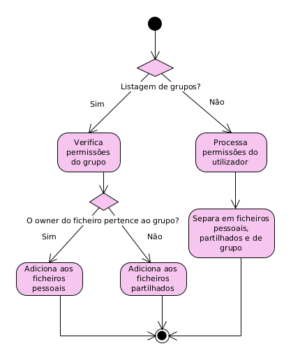

# Relatório de Projeto: Serviço de Cofre Seguro

**Data:** 02/05/2025 | **Disciplina:** Segurança em Sistemas Informáticos | **Curso:** Licenciatura em Engenharia Informática

### Autores

| Número | Nome                              |
|--------|-----------------------------------|
| 104100 | Hélder Ricardo Ribeiro Gomes      |
| 90817  | Mariana Rocha Cristino            |
| 104082 | Pedro Figueiredo Pereira          |
---

## Índice

1. [Introdução](#introdução)
2. [Descrição Geral do Projeto](#descrição-geral-do-projeto)
3. [Objetivos](#objetivos)
4. [Levantamento de Requisitos](#levantamento-de-requisitos)
   1. [Funcionais](#funcionais)
   2. [Segurança](#segurança)
5. [Modelação de Ameaças (Threat Model)](#modelação-de-ameaças-threat-model)
   1. [Identificação de Ameaças](#identificação-de-ameaças)
   2. [Diagrama de Fluxo de Dados e Barreiras](#diagrama-de-fluxo-de-dados-e-barreiras)
   3. [Análise de Risco](#análise-de-risco)
6. [Plano de Implementação](#plano-de-implementação)
   1. [Estabelecimento da comunicação servidor cliente](#estabelecimento-da-comunicação-servidor-cliente)
   2. [Aplicação do protocolo criptográfico Diffie-Hellman](#aplicação-do-protocolo-criptográfico-Diffie-Hellman)
   3. [Atualização do protocolo criptográfico base para Station-To-Station](#atualização-do-protocolo-criptográfico-base-para-Station-To-Station)
   4. [Estruturação do processo de serialização/deserialização](#estruturação-do-processo-de-serialização/deserialização)
   5. [Implementação dos comandos propostos](#implementação-dos-comandos-propostos)
   6. [Conceção de extras](#conceção-de-extras)
7. [Extras](#extras)
   1. [Autoridade Certificadora Própria](#autoridade-certificadora-própria)
   2. [Sistema de Registo de Logs](#sistema-de-registo-de-logs)
   3. [Autenticação Baseada em Ficheiros P12](#autenticação-baseada-em-ficheiros-p12)
   4. [Protocolo de Comunicação em JSON](#protocolo-de-comunicação-em-json)
   5. [Possibilidade de execução do comando share para grupos](#possibilidade-de-execução-do-comando-share-para-grupos)
8. [Manual de utilização](#manual-de-utilização)
9. [Conclusões](#conclusões)
10. [Referências](#referências)

---

## Introdução
**Responsável:** P

_Breve contextualização da importância de garantir confidencialidade, integridade e disponibilidade num serviço de cofre seguro._

## Descrição Geral do Projeto
**Responsável:** P

_Descrição sucinta do serviço: cofre pessoal, grupos, armazenamento e partilha de ficheiros._

## Objetivos
**Responsável:** P

- Garantir confidencialidade do conteúdo armazenado
- Assegurar integridade e autenticidade das operações
- Disponibilizar interface CLI simples e intuitiva

## Levantamento de Requisitos
**Responsável:** T

_Lista de requisitos funcionais e de segurança, com prioridades e justificações._

### Funcionais

      Exemplo: O serviço deve permitir que cada utilizador se registe.

### Segurança

      Descrever para cada uma das palavras-chave do enunciado: autenticidade, integridade e confidencialidade

## Modelação de Ameaças (Threat Model)
**Responsável:** T

### Identificação de Ameaças

_Enumeração das principais ameaças (STRIDE)._

### Diagrama de Fluxo de Dados e Barreiras

_Inserir DFD simplificado e definição das barreiras de segurança._

### Análise de risco

_Realizar ponderação de risco de acordo com as métricas abordadas na aula._

## Plano de Implementação

### Estabelecimento da comunicação servidor cliente
**Responsável:** M

### Aplicação do protocolo criptográfico Diffie-Hellman
**Responsável:** P

### Atualização do protocolo criptográfico base para Station-To-Station
**Responsável:** M

### Estruturação do processo de serialização/deserialização
**Responsável:** H

### Implementação dos comandos propostos
**Responsável:** T (cada um aponta funcionamento geral e edge cases dos seus comandos)

#### add \<file-path>

#### read \<file-id>

#### list [-u \<user-id> | -g \<group-id>]

O cliente envia para o servidor um pedido de listagem para um utilizador ou grupo.
O servidor verifica todos os ficheiros e categoriza em 3 grupos:
1. **Ficheiros Pessoais**:
  - para um utilizador: ficheiros onde o utilizador é o dono do ficheiro;
  - para um grupo: ficheiros que pertencem exclusivamente ao grupo, ou seja, o dono do ficheiro pertence ao grupo.

2. **Ficheiros Partilhados**:
  - para um utilizador: ficheiros partilhados diretamente com o utilizador via _users_ nas permissões;
  - para um grupo: ficheiros partilhados com o grupo nas permissões.

3. **Ficheiros de Grupo**:
Ficheiros partilhados com grupos aos quais o utilizador pertence. Os ficheiros de grupo são apenas para listagem do utilizador, pois um grupo não pode pertencer a um grupo, de modo que não terá os ficheiros em questão.

Podemos ver de seguida o fluxo de decisão que decorre para este comando:

<p align="center">

</p>

#### share \<file-id> \<target-id> --permission=[r|w]

Para um cliente partilhar um ficheiro para outro utilizador ou para um grupo, são realizados os seguintes passos:

1. Pedido de Chaves:

O cliente solicita a chave pública do _target_ e a sua chave simétrica encriptada do ficheiro. Caso
o _target_ seja um grupo, são solicitadas as chaves públicas de todos os utilizadores.
Isto permite ao cliente preparar a encriptação adequada para proteger a chave do ficheiro durante a
partilha, caso este seja o dono do ficheiro.

2. Encriptação Segura:

Caso o ficheiro pertença ao cofre pessoal do cliente, poderá então desencriptar a chave do ficheiro
e re-encriptá-la especificamente para o utilizador ou para todos os utilizadores do grupo.

Isto garante que apenas o destinatário possa desencriptar e usar o ficheiro, mantendo a confidencialidade.

3. Verificações:

O servidor valida novamente que o cliente que partilha é o proprietário do ficheiro e que o ficheiro
não pertence a um grupo, evitando partilhas indevidas.

4. Atualização de Permissões:

Se o destinatário for um utilizador, adiciona-se, nas permissões, à lista de _users_.

Se for um grupo, adiciona-se à lista de _groups_ com as chaves de cada membro.
De modo a permitir uma gestão de acessos granular e segura.

Pode-se assumir que, se o utilizador conceder permissão de escrita, automaticamente dará também
permissão de leitura, uma vez que não faz sentido permitir que escreva num ficheiro sem poder lê-lo.

#### delete \<file-id>

Quando um utilizador realiza o comando de apagar um ficheiro, temos 3 casos:
1. Se o utilizador for **dono** do ficheiro, o servidor elimina o ficheiro e limpa todas as referências relacionadas com o mesmo.
2. Se o utilizador for **dono de um grupo** e o ficheiro pertencer ao cofre do grupo, o servidor elimina o ficheiro e todas as suas referências.
3. Se o ficheiro não for do cofre pessoal do utilizador (ficheiro partilhado), o acesso do utilizador é removido, no entanto o ficheiro continua a existir para os outros utilizadores.

#### replace \<file-id> \<file-path>

Para um cliente pretende realizar um _replace_ de um ficheiro, são realizados os seguintes passos:

1. Pedido de Chaves:

O servidor verifica que o cliente tem autorização de escrita sobre o ficheiro e envia-lhe a sua chave que decifra o ficheiro.

2. Substituição no Cliente:

O cliente decifra a chave simétrica e, com esta, cifra o novo ficheiro e envia o ficheiro cifrado para o servidor.

3. Substituição no Servidor:

O servidor confirma novamente que o cliente tem permissão de escrita sobre o ficheiro. Caso se verifique, o conteúdo do ficheiro e o seu tamanho são atualizados.

#### details \<file-id>

#### revoke \<file-id> \<target-id>

#### group create \<group-name>

#### group delete \<group-id>

#### group add-user \<group-id> \<user-id> --permission=[r|w]

Quando um utilizador pretende adicionar outro utilizador a um grupo, são realizados os seguintes passos:

1. Pedido de Chaves:

O cliente que realiza a operação solicita ao servidor as suas chaves dos ficheiros associados ao grupo e a chave pública do cliente que pretende adicionar ao grupo. Este pedido só é aceite se o cliente for o dono do grupo, garantindo que apenas o proprietário tem autoridade para alterar a composição do grupo.

2. Preparação no Cliente:

O cliente decifra as chaves dos ficheiros do grupo com a sua chave privada e cifra essas chaves com a chave pública do novo utilizador. Esta operação é essencial para que o novo membro possa aceder de forma segura aos ficheiros do grupo, com base na sua própria chave privada.

3. Pedido de Adição:

O cliente envia o pedido de adição, incluindo as chaves encriptadas para o novo utilizador e a indicação da permissão atribuída (read ou write).

4. Validação e Atualização no Servidor:

O servidor confirma que quem está a adicionar é efetivamente o dono do grupo. Caso se confirme:

O novo utilizador é adicionado à lista de membros do grupo com as permissões indicadas.

Atualiza as entradas dos ficheiros partilhados no grupo, adicionando a chave encriptada correspondente ao novo membro.

Se o utilizador já for membro do grupo, as permissões são atualizadas conforme necessário, mas sem duplicar a entrada.

#### group delete-user \<group-id> \<user-id>

#### group list

Quando um utilizador executa o comando para listar os grupos a que pertence, são realizados os seguintes passos:

1. Pedido de Listagem:

O cliente envia ao servidor um pedido para obter os grupos em que está inserido. Este pedido não requer parâmetros adicionais, pois o servidor consegue identificar o utilizador através da sessão segura já estabelecida.

2. Processamento no Servidor:

O servidor consulta o registo de grupos e identifica todos aqueles onde o utilizador se encontra como membro. Para cada grupo, o servidor indica também as suas permissões associadas (read ou read, write).

#### group add \<group-id> \<file-path>

#### exit

### Conceção de extras
**Responsável:** M

## Extras

### Autoridade Certificadora Própria
**Responsável:** P

_Execução como daemon para emissão e validação de certificados X.509._

### Sistema de Registo de Logs
**Responsável:** H

_Arquitetura do serviço de logs: formato e armazenamento._

### Autenticação Baseada em Ficheiros P12
**Responsável:** P

_Utilização de keystores PKCS#12 para identificação (cliente/servidor)._

### Protocolo de Comunicação em JSON
**Responsável:** H

_Definição de mensagens JSON para operações (add, list, share, ...)._

### Possibilidade de execução do comando share para grupos
**Responsável:** M

_Descrição do motivo do aparecimento do comando e provar a praticidade do mesmo._

## Manual de utilização
**Responsável:** H

_Explicação de como deve ser o executado e guia de utilização de exemplos já disponíveis._

> Para já disponibilizo a parte relevante do nosso README.md antigo.

```
Server: python3 -m server.server

Client: python3 -m client.client

CA: cd certification-authority && python3 ca_daemon.py
```

## Conclusões
**Responsável:** M

_Resumo das decisões tomadas e perspetivas de melhorias futuras._

## Referências
**Responsável:** T (cada um preenche de acordo com a sua necessidade)

- Enunciado do Projeto (SSI).
- [Cloudflare Learning](https://www.cloudflare.com/learning/)
- ...
