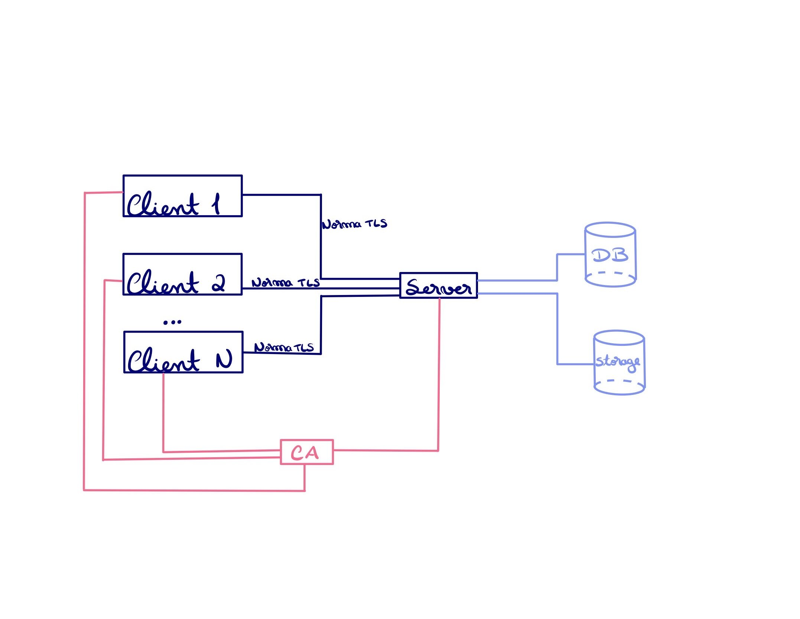
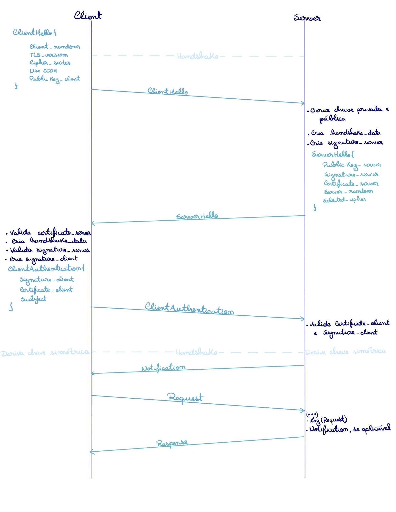
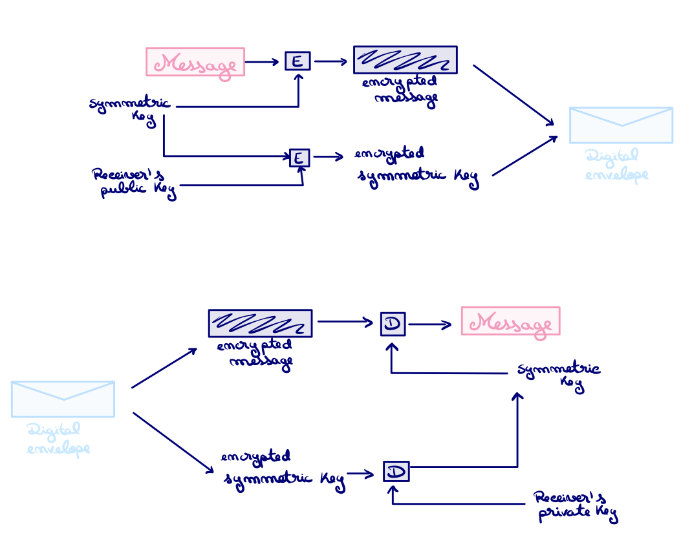
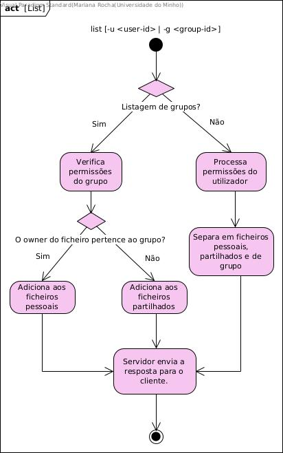
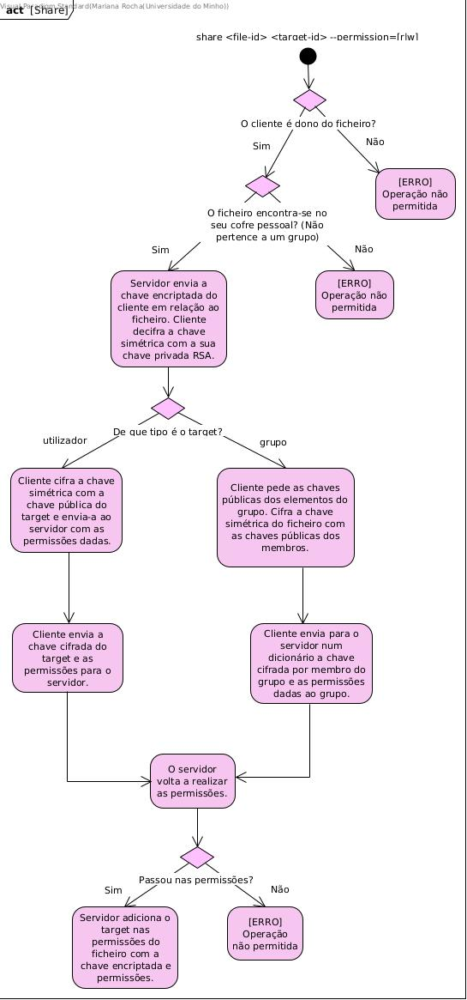
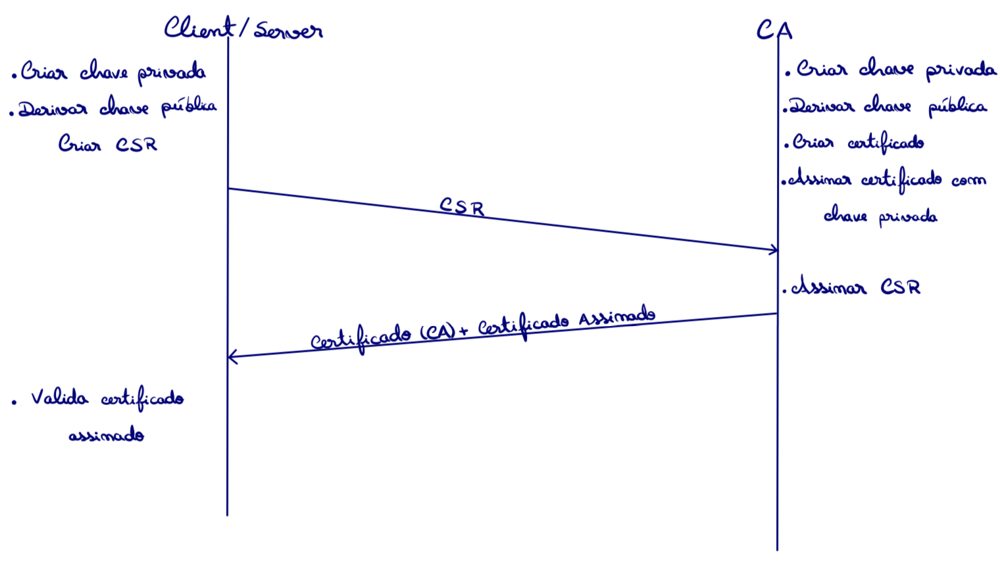

# Relatório de Projeto: Serviço de Cofre Seguro

**Data:** 04/05/2025 | **Disciplina:** Segurança em Sistemas Informáticos | **Curso:** Licenciatura em Engenharia Informática

### Autores

| Número | Nome                              |
|--------|-----------------------------------|
| 104100 | Hélder Ricardo Ribeiro Gomes      |
| 90817  | Mariana Rocha Cristino            |
| 104082 | Pedro Figueiredo Pereira          |
---

## Índice

1. [Introdução](#introdução)
2. [Descrição Geral do Projeto](#descrição-geral-do-projeto)
3. [Objetivos](#objetivos)
4. [Requisitos de Segurança](#requisitos-de-segurança)
5. [Modelação de Ameaças (Threat Model)](#modelação-de-ameaças-threat-model)
6. [Arquitetura da solução](#arquitetura-da-solução)
7. [Plano de Implementação](#plano-de-implementação)
   1. [Estabelecimento da comunicação servidor cliente](#estabelecimento-da-comunicação-servidor-cliente)
   2. [Aplicação do protocolo criptográfico Diffie-Hellman](#aplicação-do-protocolo-criptográfico-Diffie-Hellman)
   3. [Atualização do protocolo criptográfico base para Station-To-Station](#atualização-do-protocolo-criptográfico-base-para-Station-To-Station)
   4. [Estruturação do processo de serialização/deserialização](#estruturação-do-processo-de-serialização/deserialização)
   5. [Implementação dos comandos propostos](#implementação-dos-comandos-propostos)
   6. [Conceção de extras](#conceção-de-extras)
8. [Extras](#extras)
   1. [Autoridade Certificadora Própria](#autoridade-certificadora-própria)
   2. [Sistema de Registo de Logs](#sistema-de-registo-de-logs)
   3. [Autenticação Baseada em Ficheiros P12](#autenticação-baseada-em-ficheiros-p12)
   4. [Protocolo de Comunicação em JSON](#protocolo-de-comunicação-em-json)
   5. [Possibilidade de execução do comando share para grupos](#possibilidade-de-execução-do-comando-share-para-grupos)
   6. [Norma TLS com DH e ECDH](#norma-TLS-com-DH-e-ECDH)
   7. [Sistema de notificações](#sistema-de-notificações)
   8. [Isolamento do processo e recursos do servidor](#isolamento-do-processo-e-recursos-do-servidor)
9. [Manual de utilização](#manual-de-utilização)
10. [Conclusões](#conclusões)
11. [Referências](#referências)

---

## Introdução

O presente projeto consiste na implementação de um serviço de cofre seguro, que permite o armazenamento e partilha de ficheiros de forma segura. O serviço é projetado para garantir a confidencialidade, integridade e autenticidade dos dados armazenados. Neste relatório, serão abordados os objetivos do projeto, os requisitos de segurança implementados, a modelação de ameaças, a arquitetura da solução e o plano de implementação.

## Descrição Geral do Projeto

O serviço de cofre seguro é uma aplicação que permite aos utilizadores armazenar e partilhar ficheiros de forma segura. Cada utilizador tem um cofre pessoal, onde pode guardar os seus ficheiros, pode criar grupos e partilhar ficheiros com outros utilizadores. O serviço utiliza criptografia simétrica e assimétrica para proteger os dados e garantir a confidencialidade das comunicações. Além disso, implementa um sistema de permissões para controlar o acesso aos ficheiros, permitindo que os utilizadores partilhem ficheiros com outros utilizadores ou grupos de forma segura.

## Objetivos

- Proporcionar um serviço de armazenamento e partilha de ficheiros com garantias de confidencialidade, integridade e autenticidade.

- Garantir que o conteúdo dos ficheiros permanece inacessível a utilizadores não autorizados, incluindo o próprio servidor.

- Assegurar que todas as operações realizadas são verificáveis e que não possam ser negadas (não-repúdio).

- Disponibilizar uma interface em linha de comandos (CLI) clara, intuitiva e funcional para os utilizadores.

- Suportar a criação e gestão de grupos de utilizadores, com controlo granular de permissões de acesso.

- Permitir a partilha seletiva de ficheiros com utilizadores ou grupos, mantendo o controlo de acessos através de mecanismos criptográficos robustos.

- Garantir a interoperabilidade entre cliente e servidor através de uma comunicação segura e normalizada (por exemplo: norma semelhante a TLS, JSON).

- Promover a extensibilidade da aplicação, permitindo futuras melhorias ou funcionalidades adicionais sem comprometer a segurança.

## Requisitos de Segurança

1. **Autenticidade**:
    - Exigir senhas fortes com no mínimo 16 caracteres, incluindo letras maiúsculas, minúsculas, números e símbolos.
    - Utilizar certificados digitais para autenticação mútua entre cliente e servidor.

2. **Integridade**:
    - Impedir modificações não autorizadas nos ficheiros.
    - Implementar um sistema de logs para registar todas as operações realizadas.
    - Garantir que os ficheiros não possam ser acedidos por utilizadores não autorizados.

3. **Confidencialidade**:
    - Utilizar criptografia simétrica para proteger o conteúdo dos ficheiros.
    - Implementar um sistema de chaves públicas e privadas para garantir a confidencialidade das comunicações.
    - Os ficheiros partilhados são apenas acessíveis aos utilizadores destinatários.
    - Proteger as chaves simétricas com criptografia assimétrica.
    - Implementar um sistema de permissões para controlar o acesso aos ficheiros.

## Modelação de Ameaças (Threat Model)

| Ameaça | Descrição do Ataque | Minimização |
|--------------|---------------------------------------------------------------------------|---------------------------------------------------------------------------|
| **Spoofing** | Intercetar pedidos entre cliente e servidor e assumir a identidade de ambos. | Implementar protocolos para a criação de um canal seguro, tais como TLS ou Station to Station. |
| **Tampering**| Modificação não autorizada de dados do sistema. | Implementação de um sistema de logs e utilização de criptografia nas comunicações e ficheiros. |
| **Repudiation** | Negação de uma ação realizada sem possibilidade de provar o contrário. | Realizar verificações de integridade através do sistema de logs e autenticação com certificados digitais.|
| **Information Disclosure** | Acesso não autorizado a informação sensível. | Isolamento do processo servidor e dados adjacentes e controlo de acessos. |
| **Denial of Service** | Submissão de ficheiros extremamente grandes. | Limitação do tamanho do ficheiro. |
| **Elevation of Privilege** | Explorar configurações indevidas do sistema. | Garantia de isolamento do sistema operativo. |

> O sistema não implementa medidas específicas para prevenir ataques de negação de serviço, como a limitação do número de pedidos simultâneos ou a proteção contra ficheiros excessivamente grandes. Considera-se que a responsabilidade pela mitigação deste tipo de ataques recai sobre a infraestrutura de rede subjacente.

## Arquitetura da solução

A arquitetura da aplicação divide-se em três componentes principais, clientes, servidor e os seus de dados, e autoridade certificadora (CA), conforme ilustrado na figura abaixo.

<p align="center">  </p>

Os clientes representam os utilizadores da aplicação que interagem com o sistema. Cada cliente é instanciado de forma autónoma, deve manter estado mínimo, não tem memória persistente e depende exclusivamente do servidor para a gestão e controlo de acesso aos dados. Este modelo "stateless" facilita o isolamento e reduz a superfície de ataque no lado do cliente.

O servidor constitui o núcleo da aplicação e é responsável por manter o estado global do sistema. Funciona num ambiente isolado, em conformidade com as normas de segurança definidas no âmbito do projeto. É neste componente que residem todos os dados e metadados necessários à execução das funcionalidades do cofre seguro.

A autoridade certificadora é um dos componentes fundamentais da infraestrutura de segurança da aplicação. Trata-se de uma entidade confiável (trusted third party) responsável por emitir e validar os certificados digitais dos restantes componentes (clientes e servidor). Todos os certificados utilizados no sistema são assinados digitalmente pela CA, garantindo a autenticidade das entidades.

O diagrama de sequência apresentado ilustra um exemplo do processo de estabelecimento de uma sessão segura entre um cliente e o servidor da aplicação, recorrendo a um protocolo semelhante à norma TLS com autenticação mútua. Este mecanismo é fundamental para garantir confidencialidade, integridade e autenticidade nas comunicações entre as partes.

<p align="center">

</p>

## Plano de Implementação

### Estabelecimento da comunicação servidor cliente

O processo de estabelecer uma comunicação segura entre o cliente e o servidor inicia com um
protocolo de _handshake_ personalizado, pensado para assegurar a autenticação mútua e a criação
confiável de chaves de sessão. Esse processo é fundamentado em três componentes principais: a troca
de chaves momentâneas, a validação de certificados digitais e a derivação de chaves simétricas.

Na fase inicial, o cliente envia uma mensagem (ClientHello) que contêm uma chave pública efémera
(gerada usando ECDH ou DH), um valor aleatório (client random) e uma lista de algoritmos que este
suporta. Por sua vez, o servidor responde com a sua própria chave pública, um certificado
digital assinado pela CA, um valor aleatório (server random) e a escolha do algoritmo de cifra.
Ambas as partes validam mutuamente os certificados, garantindo que as identidades coincidem com as
chaves públicas apresentadas.

A segurança do canal é assegurada pela troca de segredos efémeros: o cliente e o servidor combinam as suas
chaves públicas para gerar um segredo compartilhado, que é expandido com os valores aleatórios
com o uso de uma função de derivação de chaves (como o HKDF). O resultado desta operação é uma chave
simétrica exclusiva para a sessão em que se encontram, utilizada para criptografar as mensagens subsequentes.

### Aplicação do protocolo criptográfico Diffie-Hellman

Após uma implementação da comunicação entre o cliente e o servidor não segura, foi necessário implementar o protocolo Diffie-Hellman para garantir a confidencialidade e integridade dos dados trocados entre ambos durante uma sessão.

O protocolo `Diffie-Hellman` permitiu-nos estabelecer uma chave *key_master* comum entre o cliente e o servidor, que é utilizada para cifrar e decifrar as mensagens trocadas. Para isso, o cliente e o servidor geram um par de chaves (pública e privada) e trocam as chaves públicas. Com base nas chaves públicas e privadas, ambos conseguem calcular a chave *key_master* devido à propriedade algoritmica que permite comutar uma combinação das chaves públicas e privadas. Para isso, utilizamos o algoritmo de cifra simétrica `AES` (Advanced Encryption Standard) com um tamanho de chave de 256 bits.

### Atualização do protocolo criptográfico base para Station-To-Station

A introdução do protocolo Station-to-Station (STS) trouxe uma camada adicional de autenticação
mútua explícita, isto resolve uma limitação do Diffie-Hellman clássico, que não autentica as
partes envolvidas. O STS exige que o cliente e o servidor assinem digitalmente os dados
trocados durante o _handshake_, vinculando as chaves efémeras às suas identidades.

Após a troca inicial de chaves, o servidor assina os dados do _handshake_ (as chaves públicas e
valores aleatórios) com a sua chave privada (RSA ou ECDSA) e envia a assinatura com o seu certificado.
O cliente, então, verifica a assinatura recorrendo à chave pública do servidor, que pode ser extraída
do certificado, e repete o processo, envia a sua assinatura e certificado. Este processo de validação
dupla impede que um atacante se passe por uma das partes, mesmo que consiga interceptar a comunicação.

A principal vantagem do STS é o **não-repúdio**: as assinaturas funcionam como provas criptográficas
de que ambas as partes participaram ativamente do _handshake_. Além disso, o protocolo impede ataques
Man-in-the-Middle, uma vez que um atacante teria que falsificar assinaturas sem ter acesso às
chaves privadas legítimas, o que é praticamente inviável computacionalmente.

### Estruturação do processo de serialização/deserialização

A comunicação entre cliente e servidor é feita através de mensagens estruturadas em JSON, utilizando para cada tipo de pedido uma estrutura de pedido e uma de resposta. Para facilitar a definição e manipulação dessas estruturas, são utilizadas dataclasses, que permitem representar os dados de forma clara e concisa.

Exemplo de uma estrutura de pedido e resposta:

 ```
@dataclass
class AddRequest:
    filename: str
    encrypted_file: str
    encrypted_aes_key: str

@dataclass
class AddResponse:
    response: str
 ```

O método serialize_request e deserialize_request, permite de forma totalmente genérica processar a mensagens a ser enviadas, deste modo facilitando a comunicação.

### Envelope Digital

O **envelope digital** foi adotado no projeto como o mecanismo principal para a partilha de ficheiros,
é utilizada uma combinação de criptografia simétrica (AES-256-GCM) e assimétrica (RSA). Esse método
híbrido foi projetado para garantir tanto a segurança quanto a eficiência, cumprindo os requisitos
de confidencialidade e integridade exigidos pelo sistema.

No funcionamento do sistema, quando um ficheiro é adicionado, o cliente gera uma chave simétrica
AES-256 para cifrar o conteúdo. Essa chave simétrica é então cifrada com a chave pública do dono e
armazenada no servidor. Ao partilhar o ficheiro, o servidor recupera a chave AES cifrada e o cliente
a decifrar com a sua chave privada. Para cada destinatário, a chave AES é recifrada com a chave pública
do destinatário, onde é criado um "envelope" seguro para cada entidade envolvida.

Quando o destinatário acede o ficheiro, este utiliza a sua chave privada para decifrar a chave AES
e, em seguida, usa essa chave para aceder ao conteúdo do ficheiro. Este processo assegura que a
chave simétrica nunca seja transmitida de forma não segura, mantendo a confidencialidade e a
integridade das informações.

As vantagens desta implementação são evidentes no contexto do projeto. A confidencialidade é garantida,
pois a chave AES nunca é transmitida em texto simples, e somente o destinatário correto pode acede-la.
Além disso, o uso de criptografia simétrica para o ficheiro e assimétrica apenas para a chave
reduz o custo computacional, sendo eficiente mesmo para grandes volumes de dados. A integridade dos
dados é automaticamente verificada com algoritmos como AES-GCM ou ChaCha20-Poly1305, e as assinaturas
digitais adicionam uma camada de não-repúdio, onde associam as ações a identidades de forma segura.

<p align="center">

</p>

### Implementação dos comandos propostos

#### add \<file-path>

O cliente envia ao servidor um pedido para adicionar um ficheiro que se encontra numa determinada rota.

Para enviar o ficheiro ao servidor, o cliente:

1. Cria uma chave simétrica e utiliza-a para encriptar o ficheiro a enviar.

2. Utiliza a sua chave pública para encriptar a chave simétrica.

3. Envia ao servidor a chave simétrica encriptada com a chave pública do utilizador, juntamente com o ficheiro encriptado com a chave simétrica.

Após a recepção, o servidor:

1. Adiciona à base de dados a informação necessária sobre o ficheiro, incluindo: um ID gerado pelo servidor, o nome do ficheiro, o tamanho, o ID do proprietário, as permissões (apenas para o proprietário, com permissões totais), a data de adição e o local onde o ficheiro se encontra armazenado.

2. Guarda o ficheiro recebido no local designado.

3. Envia uma mensagem ao cliente com o id associado ao ficheiro.

#### read \<file-id>

O cliente envia ao servidor um pedido para ler um ficheiro com um determinado id.

O servidor verifica se o ficheiro solicitado existe e se o utilizador que fez o pedido tem permissão de leitura. Caso ambas as condições se verifiquem, envia ao utilizador o conteúdo do ficheiro, bem como a chave simétrica que encriptou o conteúdo associada ao utilizador em questão, ou seja, a chave encriptada com a chave pública do utilizador que efetuou o pedido.

Após receber a resposta do servidor, o cliente utiliza a sua chave privada para desencriptar a chave simétrica e, posteriormente, usa essa chave para desencriptar o conteúdo do ficheiro.

#### list [-u \<user-id> | -g \<group-id>]

O cliente envia para o servidor um pedido de listagem para um utilizador ou grupo.
O servidor verifica todos os ficheiros e categoriza em 3 grupos:
1. **Ficheiros Pessoais**:
  - para um utilizador: ficheiros onde o utilizador é o dono do ficheiro;
  - para um grupo: ficheiros que pertencem exclusivamente ao grupo, ou seja, o dono do ficheiro pertence ao grupo.

2. **Ficheiros Partilhados**:
  - para um utilizador: ficheiros partilhados diretamente com o utilizador via _users_ nas permissões;
  - para um grupo: ficheiros partilhados com o grupo nas permissões.

3. **Ficheiros de Grupo**:
Ficheiros partilhados com grupos aos quais o utilizador pertence. Os ficheiros de grupo são apenas para listagem do utilizador, pois um grupo não pode pertencer a um grupo, de modo que não terá os ficheiros em questão.

Podemos ver de seguida o fluxo de decisão que decorre para este comando:

<p align="center">

</p>

#### share \<file-id> \<target-id> --permission=[r|w]

Para um cliente partilhar um ficheiro para outro utilizador ou para um grupo, são realizados os seguintes passos:

1. Pedido de Chaves:

O cliente solicita a chave pública do _target_ e a sua chave simétrica encriptada do ficheiro. Caso
o _target_ seja um grupo, são solicitadas as chaves públicas de todos os utilizadores.
Isto permite ao cliente preparar a encriptação adequada para proteger a chave do ficheiro durante a
partilha, caso este seja o dono do ficheiro.

2. Encriptação Segura:

Caso o ficheiro pertença ao cofre pessoal do cliente, poderá então desencriptar a chave do ficheiro
e re-encriptá-la especificamente para o utilizador ou para todos os utilizadores do grupo.

Isto garante que apenas o destinatário possa desencriptar e usar o ficheiro, mantendo a confidencialidade.

3. Verificações:

O servidor valida novamente que o cliente que partilha é o proprietário do ficheiro e que o ficheiro
não pertence a um grupo, evitando partilhas indevidas.

4. Atualização de Permissões:

Se o destinatário for um utilizador, adiciona-se, nas permissões, à lista de _users_.

Se for um grupo, adiciona-se à lista de _groups_ com as chaves de cada membro.
De modo a permitir uma gestão de acessos granular e segura.

Pode-se assumir que, se o utilizador conceder permissão de escrita, automaticamente dará também
permissão de leitura, uma vez que não faz sentido permitir que escreva num ficheiro sem poder lê-lo.

<p align="center">

</p>

#### delete \<file-id>

Quando um utilizador realiza o comando de apagar um ficheiro, temos 3 casos:
1. Se o utilizador for **dono** do ficheiro, o servidor elimina o ficheiro e limpa todas as referências relacionadas com o mesmo.
2. Se o utilizador for **dono de um grupo** e o ficheiro pertencer ao cofre do grupo, o servidor elimina o ficheiro e todas as suas referências.
3. Se o ficheiro não for do cofre pessoal do utilizador (ficheiro partilhado), o acesso do utilizador é removido, no entanto o ficheiro continua a existir para os outros utilizadores.

#### replace \<file-id> \<file-path>

Para um cliente pretende realizar um _replace_ de um ficheiro, são realizados os seguintes passos:

1. Pedido de Chaves:

O servidor verifica que o cliente tem autorização de escrita sobre o ficheiro e envia-lhe a sua chave que decifra o ficheiro.

2. Substituição no Cliente:

O cliente decifra a chave simétrica e, com esta, cifra o novo ficheiro e envia o ficheiro cifrado para o servidor.

3. Substituição no Servidor:

O servidor confirma novamente que o cliente tem permissão de escrita sobre o ficheiro. Caso se verifique, o conteúdo do ficheiro e o seu tamanho são atualizados.

#### details \<file-id>

O comando de `details` não tem uma lógica complexa, uma vez que, após o cliente enviar o pedido, o servidor apenas verifica se o ficheiro existe e se o cliente tem pelo menos permissão de leitura sobre o mesmo. Se sim, o servidor consulta os detalhes do ficheiro, entre eles, o `identificador`, o `nome`, o `tamanho`, o `dono`, as `permissões de cada utilizador associado` e a `data de criação` e envia-os para o cliente.

#### revoke \<file-id> \<target-id>

O comando `revoke` permite ao proprietário de um ficheiro revogar o acesso de um utilizador ou grupo a esse ficheiro. A lógica implementada segue os seguintes passos:

1. **Validação Inicial**:
  - O servidor verifica se o `target-id` (utilizador ou grupo) não é o próprio cliente que está a realizar o pedido, uma vez que um utilizador não pode revogar o seu próprio acesso.
  - O servidor valida se o ficheiro existe e se o cliente que realizou o pedido é o proprietário do ficheiro. Caso contrário, o pedido é rejeitado.

2. **Remoção de Permissões**:
  - Se o `target-id` for um grupo (identificado pelo prefixo `g`), o servidor procura nas permissões do ficheiro a entrada correspondente ao grupo e remove-a.
  - Se o `target-id` for um utilizador, o servidor procura nas permissões do ficheiro a entrada correspondente ao utilizador e remove-a.
  - Esta operação remove todas as permissões, independetemente das mesmas serem de leitura ou escrita.

3. **Atualização do Ficheiro**:
  - As permissões atualizadas são guardadas no ficheiro correspondente.
  - O servidor atualiza o registo de ficheiros persistente para refletir as alterações.

#### group create \<group-name>

O cliente, para criar um grupo, envia ao servidor o nome do grupo que pretende criar.

O servidor recebe esse pedido e adiciona à sua base de dados um novo grupo, contendo um ID gerado pelo próprio servidor, o nome do grupo enviado pelo cliente, o dono do grupo (o cliente que fez o pedido), e um primeiro membro, sendo o próprio cliente, com permissões totais.
Adicionalmente, é atualizada a informação do utilizador, associando-lhe o grupo que acabou de criar e no qual entra automaticamente.

O servidor envia ao cliente uma mensagem com o ID do grupo recém-criado.

#### group delete \<group-id>

Quando um utilizador pretende eliminar um grupo, o sistema segue 3 passos fundamentais:

1. **Validação Inicial**:
  - O servidor verifica se o grupo existe. Caso contrário, o pedido é rejeitado.
  - O servidor valida se o utilizador que realizou o pedido é o proprietário do grupo. Apenas o dono do grupo tem permissão para eliminá-lo. Caso contrário, o pedido é rejeitado.

2. **Remoção do Grupo**:
  - O grupo é removido da lista de grupos persistente no servidor.
  - Para cada utilizador que pertence ao grupo, o grupo é removido da lista de grupos associados ao utilizador.

3. **Atualização de Ficheiros**:
  - O servidor verifica todos os ficheiros associados ao grupo. Para cada ficheiro:
    - Remove as permissões associadas ao grupo.
    - Caso o ficheiro não tenha mais permissões associadas (nem de utilizadores nem de outros grupos), significa que pertencia exclusivamente ao grupo removido e é eliminado do sistema de armazenamento e da lista de ficheiros persistente.

Este processo garante que a eliminação do grupo é segura e que todos os recursos associados ao grupo são devidamente atualizados ou removidos.

#### group add-user \<group-id> \<user-id> --permission=[r|w]

Quando um utilizador pretende adicionar outro utilizador a um grupo, são realizados os seguintes passos:

1. Pedido de Chaves:

O cliente que realiza a operação solicita ao servidor as suas chaves dos ficheiros associados ao grupo e a chave pública do cliente que pretende adicionar ao grupo. Este pedido só é aceite se o cliente for o dono do grupo, garantindo que apenas o proprietário tem autoridade para alterar a composição do grupo.

2. Preparação no Cliente:

O cliente decifra as chaves dos ficheiros do grupo com a sua chave privada e cifra essas chaves com a chave pública do novo utilizador. Esta operação é essencial para que o novo membro possa aceder de forma segura aos ficheiros do grupo, com base na sua própria chave privada.

3. Pedido de Adição:

O cliente envia o pedido de adição, incluindo as chaves encriptadas para o novo utilizador e a indicação da permissão atribuída (read ou write).

4. Validação e Atualização no Servidor:

O servidor confirma que quem está a adicionar é efetivamente o dono do grupo. Caso se confirme:

O novo utilizador é adicionado à lista de membros do grupo com as permissões indicadas.

Atualiza as entradas dos ficheiros partilhados no grupo, adicionando a chave encriptada correspondente ao novo membro.

Se o utilizador já for membro do grupo, as permissões são atualizadas conforme necessário, mas sem duplicar a entrada.

#### group delete-user \<group-id> \<user-id>

Para eliminar um utilizador de um grupo do qual é dono, o cliente deve enviar ao servidor o ID do utilizador que pretende remover e o ID do grupo em que deseja efetuar essa operação.

O servidor verifica se o grupo existe, se o cliente que está a realizar a operação é o dono do grupo e se o utilizador a remover não é o próprio dono. Caso todas estas condições se verifiquem, o servidor procede da seguinte forma:

1. Atualiza o grupo, removendo o utilizador em causa.

2. Atualiza a informação do utilizador removido, eliminando a associação ao grupo.

3. Retira as permissões de acesso aos ficheiros pertencentes ao grupo, removendo a chave encriptada associada ao utilizador eliminado.

4. Se o utilizador removido for o proprietário de algum ficheiro do grupo, esses ficheiros são eliminados por completo.

Por fim, é enviada ao cliente uma mensagem de sucesso confirmando a remoção.

#### group list

Quando um utilizador executa o comando para listar os grupos a que pertence, são realizados os seguintes passos:

1. Pedido de Listagem:

O cliente envia ao servidor um pedido para obter os grupos em que está inserido. Este pedido não requer parâmetros adicionais, pois o servidor consegue identificar o utilizador através da sessão segura já estabelecida.

2. Processamento no Servidor:

O servidor consulta o registo de grupos e identifica todos aqueles onde o utilizador se encontra como membro. Para cada grupo, o servidor indica também as suas permissões associadas (read ou read, write).

#### group add \<group-id> \<file-path>

Quando um utilizador pretende adicionar um ficheiro a um grupo, o sistema segue os seguintes passos:

1. **Pedido de Adição**:
   - O cliente inicia o processo indicando que deseja adicionar um ficheiro a um grupo específico.
   - O servidor verifica as permissões do utilizador relativamente ao grupo. Caso o utilizador tenha permissões de escrita sobre o mesmo, o servidor envia as chaves públicas de todos os membros do grupo, incluindo a do próprio utilizador.

2. **Preparação no Cliente**:
   - O cliente gera uma chave simétrica utilizando o algoritmo `AES-GCM` para cifrar o ficheiro.
   - Em seguida, o cliente itera por todas as chaves públicas recebidas (incluindo a sua própria) e utiliza-as para cifrar a chave simétrica gerada.
   - O cliente junta o ficheiro cifrado, as chaves cifradas e o nome do ficheiro e envia tudo ao servidor.

3. **Processamento no Servidor**:
   - O servidor realiza as seguintes operações:
     - Verifica se o grupo existe e se o utilizador tem permissões de escrita no grupo.
     - Gera um identificador único para o ficheiro e armazena-o no sistema de ficheiros.
     - Regista as permissões do ficheiro, associando-o ao grupo e às chaves cifradas de cada membro.
     - Atualiza a base de dados de ficheiros com as informações do novo ficheiro.

Este processo garante que o ficheiro é adicionado de forma segura ao grupo, respeitando as permissões e mantendo a confidencialidade dos dados.

#### exit
O comando exit permite ao cliente encerrar a sessão de forma segura, terminando a conexão com o servidor.

### Conceção de extras

Ao longo do desenvolvimento do projeto, além da implementação dos requisitos fundamentais,
foram concebidos extras que visam reforçar a segurança, a usabilidade e a robustez do sistema.
Estes elementos complementares surgiram de forma iterativa, tanto para resolver desafios técnicos
específicos como para expandir as capacidades da aplicação, sem comprometer os princípios de
confidencialidade, integridade e autenticidade que norteiam o serviço.

## Extras

### Autoridade Certificadora Própria

Para consolidar o conhecimento do grupo de trabalho sobre conceção e utilização dos certificados digitais, foi implementada uma `Autoridade Certificadora (CA)` própria. Esta `CA` é responsável pela emissão e validação de certificados `X.509`, que são utilizados para autenticação mútua entre o cliente e o servidor.

A `CA` é executada como um "*daemon*" (é apenas um terminal em execução, uma vez que nos foi desaconselhada a implementação pela equipa docente não tendo abordado o tema), permitindo a emissão de certificados de forma contínua. Para este processo ocorrer, segue-se o seguinte fluxo:

1. **Geração de Chaves**:
  - O cliente gera um par de chaves (pública e privada) e cria um *Certificate Signing Request* (CSR) que contém a chave pública e informações sobre o utilizador, como:
    - Nome comum (*Common Name*): `x509.NameAttribute(NameOID.COMMON_NAME, common_name)`
    - Nome da organização: `x509.NameAttribute(NameOID.ORGANIZATION_NAME, u"Grupo 2 SSI")`
    - País: `x509.NameAttribute(NameOID.COUNTRY_NAME, u"PT")`
    - Estado/Província: `x509.NameAttribute(NameOID.STATE_OR_PROVINCE_NAME, u"Braga")`
    - Localidade: `x509.NameAttribute(NameOID.LOCALITY_NAME, u"Braga")`
    - Pseudônimo: `x509.NameAttribute(NameOID.PSEUDONYM, common_name)`

    - O `CSR` é assinado pela `CA`, que verifica a identidade do cliente (para efeitos académicos assina todos os `CSR's`), e emite um certificado digital.

2. **Emissão de Certificado**:
   - O certificado digital é enviado ao cliente, que o armazena localmente.
   - O cliente utiliza o certificado para autenticar-se junto do servidor, garantindo a autenticidade da comunicação.

3. **Validação de Certificado**:
   - O servidor valida o certificado do cliente, verificando a assinatura da `CA` e garantindo que o certificado não está revogado.
   - Caso a validação seja bem-sucedida, o servidor estabelece uma comunicação segura com o cliente.
   - Este processo é devidamente apresentado no processo de implementação numa primeira fase do `Station-to-Station` e, posteriormente, na implementação da norma semelhante ao `TLS`.

Além disso, foi implementado o conceito de *one-way certification*, onde a `CA` se autentica perante os clientes. Este processo garante que os clientes podem verificar a autenticidade da CA antes de confiar nos certificados emitidos, reforçando a segurança e a confiança no sistema.

<p align="center">

</p>

### Sistema de Registo de Logs

O sistema de logs foi planeado de forma a registar de forma estruturada e detalhada todas as operações críticas realizadas no sistema. Deste modo garante a consistência e facilidade de análise dos dados. Cada registo de log contém os seguintes campos principais:

- id: Identificador único do registo de log.

- userid: Identificador do utilizador responsável pela ação.

- type: Tipo de ação realizada (exemplo: criação de grupo).

- args: Argumentos associados à ação (exemplo: identificadores de grupo e nome).

- timestamp: Momento exato em que a ação foi executada, no formato UTC.

- status: Estado da operação (exemplo: "success" para sucesso, "error" para erro).

- error: Detalhes específicos de erro, se aplicável.

Este formato permite uma análise eficiente do funcionamento do sistema, facilitando a deteção de falhas, a auditoria de operações críticas e a monitoração do desempenho geral da aplicação.

### Autenticação Baseada em Ficheiros P12

Com a criação de uma `Autoridade Certificadora (CA)` própria, o grupo ficou interessado em explorar a modularização do sistema de autenticação. Ao seguir o exemplo apresendado pela equipa docente, recorreu ao sistema de autenticação baseado em `PKCS#12`.

O formato `PKCS#12` é amplamente utilizado para armazenar e transportar chaves privadas e certificados digitais de forma segura numa `key value store`. Este formato é suportado por diversas bibliotecas e ferramentas, como o `OpenSSL`, o que facilita a integração com diferentes sistemas e linguagens de programação, pelo que o grupo decidiu implementá-lo.

O processo de autenticação baseado em `PKCS#12` surgiu como complemento à `CA`, pelo que está profundamente interligado e envolve os seguintes passos:

1. **Disponibilização de um interface CLI**:
    - O sistema apresenta a opção de fazer a autenticação ou criar uma nova conta.
    - Caso o cliente já tenha uma conta, é solicitado que forneça o seu nome de utilizador e palavra-passe, segue para o passo 5.
    - Caso se pretenda criar uma nova conta, o sistema solicita ao cliente que forneça um nome de utilizador e uma palavra-passe forte (com pelos menos 16 carateres, pelo que é obrigatório conter letras maiscúlas e minúsculas, símbolos e números), segue para o passo 2.

2. **Geração de Chaves**:
    - O cliente gera um par de chaves (pública e privada) e cria um *Certificate Signing Request* (CSR) que contém a chave pública e informações sobre o utilizador, este que é o mesmo processo que ocorria numa versão anterior diretamente com a `CA`.

3. **Emissão de Certificado**:
    - O cliente envia o CSR para a `CA`, que verifica a identidade do cliente e emite um certificado digital.
    - O certificado digital é assinado pela `CA` e enviado ao cliente.

4. **Criação do PKCS#12**:
    - O cliente cria um arquivo `PKCS#12` que contém a chave privada e o certificado digital.
    - O arquivo `PKCS#12` é protegido pela palavra-passe que introduziu na CLI, garantindo a segurança da chave e certificado armazenado.

5. **Autenticação**:
    - O cliente utiliza o arquivo `PKCS#12` para autenticar-se junto do servidor.
    - O servidor valida o certificado do cliente, verificando a assinatura da `CA` e garantindo que o certificado não está revogado.
    - Caso a validação seja bem-sucedida, o servidor procede com o estabelecimento de uma comunicação segura com o cliente.

O servidor usufrui também de um arquivo `PKCS#12` que contém a sua chave privada e o seu certificado digital, permitindo a posterior autenticação mútua entre os clientes e o servidor.

### Protocolo de Comunicação em JSON

A comunicação entre cliente e servidor é baseada em mensagens JSON padronizadas, organizadas em pares de request e response para cada operação, como add, list, share, entre outras. Cada tipo de operação define a sua própria estrutura de dados, encapsulada através de `dataclasses`, o que garante clareza e fácil serialização.

Exemplo de uma estrutura de pedido e resposta:

 ```
@dataclass
class AddRequest:
    filename: str
    encrypted_file: str
    encrypted_aes_key: str

@dataclass
class AddResponse:
    response: str
 ```

Para tornar o sistema não dependente da lógica de cada operação, são utilizados dois métodos genéricos:

- `serialize_request(obj) -> str`: converte qualquer objeto de pedido e resposta (instância de uma dataclass) num JSON pronto a enviar.

- `deserialize_request(json_str) -> Tuple[str, Any]`: interpreta o JSON recebido, identifica automaticamente o tipo de operação e devolve uma instância da dataclass correspondente.

Esse mecanismo torna a comunicação robusta e genérica, permitindo ao servidor e ao cliente tratar mensagens de qualquer tipo sem depender diretamente de lógica específica de cada operação.

### Possibilidade de execução do comando share para grupos

A funcionalidade de partilha de ficheiros com grupos permite que o dono conceda acesso a múltiplos
utilizadores, isto garante que apenas membros autorizados possam decifrar o conteúdo. O processo
envolve três etapas principais: solicitação de chaves públicas dos membros do grupo, cifração da
chave simétrica do ficheiro e validações de segurança no servidor.

Isto permite ter um controlo detalhado sobre as permissões de cada grupo. Facilita a administração
de permissões em ambientes com muitos utilizadores. Apenas membros ativos de um grupo podem aceder aos
ficheiros.

### Norma TLS com DH e ECDH

A norma **TLS (Transport Layer Security)** é um padrão global para comunicação segura, esta garante
**confidencialidade**, **integridade** e **autenticação** entre as partes. Neste projeto,
foi implementado um protocolo inspirado no TLS, adaptado às necessidades do sistema de cofre seguro,
com ênfase na **troca de chaves efémeras** (via DH ou ECDH) e **autenticação baseada em certificados**.
De seguida, é explicado como é que os conceitos do TLS foram aplicados:

1. Handshake TLS-like: Autenticação e Derivação de Chaves
O processo de handshake segue uma estrutura semelhante ao TLS 1.3, mas simplificada para o sistema.
Os principais passos são:

- **ClientHello**:
O cliente envia a versão do protocolo, a lista de *cipher suites* e sua chave pública (ECDH/DH)
junto com um número aleatório (`client_random`).

- **ServerHello**:
O servidor responde com a sua chave pública, certificado digital assinado pela sua Autoridade
Certificadora (CA), assinatura digital dos dados do handshake e o seu valor aleatório (`server_random`).

- **Autenticação Mútua**: Ambas as partes validam os certificados e assinaturas.

2. **Perfect Forward Secrecy (PFS) com ECDHE/DHE**
Quer com **ECDHE** (Elliptic Curve Diffie-Hellman Ephemeral) ou com **DHE** (Diffie-Hellman Ephemeral),
a quebra de chaves de longo prazo não afete sessões anteriores é garantida, pois:

- **Geração de Chaves Temporárias**: O cliente e o servidor geram chaves temporárias para cada sessão.

- **Derivação do Segredo Compartilhado**: O segredo compartilhado é gerado via ECDH/DH, combinado com o `client_random` e
o `server_random` usando **HKDF**.

3. **Cipher Suites e Algoritmos**
O servidor implementa as seguintes cifras (combinações de algoritmos) para garantir comunicações seguras:

- AES-256-GCM com SHA-384;
- AES-128-GCM com SHA-256;
- ChaCha20-Poly1305 com SHA-256;
- ECDHE-RSA com AES-256-GCM e SHA-384;
- ECDHE-RSA com AES-128-GCM e SHA-256;
- ECDHE-RSA com ChaCha20-Poly1305.

A escolha de AES-GCM e ChaCha20-Poly1305 garante flexibilidade e robustez em diferentes cenários de
segurança. O AES-GCM é eficiente e oferece forte integridade de dados, sendo ideal para ambientes
modernos. Já o ChaCha20-Poly1305, resistente a ataques de canal lateral e mais seguro no contexto
pós-quântico, é uma boa opção para dispositivos com recursos limitados. Esta combinação assegura
uma boa segurança, adaptando-se a diferentes requisitos de performance e resiliência.

- **Negociação Dinâmica**: O servidor escolhe uma *cipher suite* com base na disponibilidade do cliente.

4. **Certificados e CA Própria**
A autenticação é realizada com **certificados X.509** emitidos por uma **Autoridade Certificadora (CA) própria**.

Apesar de ser uma implementação personalizada, o sistema segue os princípios principais do TLS:

1. **Confidencialidade**: Garantida pelo AES-256-GCM ou ChaCha20.
2. **Integridade**: Assegurada pelo HMAC (em AES-GCM) ou Poly1305 (em ChaCha20).
3. **Autenticação**: Feita por certificados digitais e assinaturas.
4. **Forward Secrecy**: Chaves temporárias que são descartadas após cada sessão.

Esta abordagem proporciona uma solução robusta, onde é combinada uma segurança reforçada com
flexibilidade para o contexto do cofre seguro.

### Sistema de notificações

O sistema de notificações alerta os utilizadores sobre ações relevantes nos seus ficheiros ou grupos.
As notificações são geradas automaticamente nos seguintes comandos:

- read: O proprietário é notificado quando outro utilizador lê o seu ficheiro.

- share: O destinatário (utilizador ou todos os membros de um grupo, exceto o remetente) recebe uma
notificação de partilha.

- group add-user: O utilizador adicionado a um grupo é informado.

- group add: Membros do grupo são alertados sobre novos ficheiros adicionados.

- replace: O proprietário é notificado se outro utilizador substituir o conteúdo do ficheiro.

- details: O proprietário é notificado quando outro utilizador consulta os detalhes do ficheiro.

As notificações são armazenadas cifradas e apenas marcadas como "lidas" após serem enviadas pelo servidor ao cliente, garantindo rastreabilidade e evitando perda de contexto. Implementado com JSON para
estruturação e integrado ao protocolo seguro, o sistema reforça a transparência das operações
sem comprometer a privacidade.

Com isto, os utilizadores têm visibilidade imediata de quem acedeu ou modificou os seus ficheiros.
Facilita a deteção de atividades suspeitas.
A adição/remoção de utilizadores em grupos (group add-user/delete-user) gera confirmações, evitando
acessos "fantasmas".
Mantém os utilizadores informados sem sobrecarregá-los (notificações são prioritárias e não intrusivas).

### Isolamento do processo e recursos do servidor

Para garantir o isolamento dos recursos do sistema operativo utilizados pelo programa, foi adotada uma abordagem que exige a configuração inicial por parte de um administrador do sistema. Esta configuração é realizada através de dois scripts principais: um para o setup inicial e outro para a inicialização do ambiente de armazenamento e base de dados. A lógica subjacente a esses scripts é descrita a seguir.

- **Configuração Inicial**:

    O primeiro passo envolve a criação de um utilizador dedicado, denominado `vault_server`, que será responsável por executar o programa. Este utilizador é configurado com as seguintes características:

  1. **Criação do Utilizador**:
      - O script verifica se o utilizador `vault_server` já existe. Caso contrário, cria-o e define uma palavra-passe fornecida pelo administrador.

  2. **Associação a Grupos**:
      - O utilizador `vault_server` é adicionado ao grupo principal do utilizador com UID 1000 (geralmente o primeiro utilizador criado no sistema), permitindo-lhe partilhar permissões de grupo.

  3. **Instalação de Dependências**:
      - O script instala a biblioteca `cryptography` no ambiente do utilizador `vault_server`, garantindo que todas as dependências necessárias para a execução do programa estão disponíveis e mantidas na versão mais recente.

- **Inicialização do Ambiente**:

    Após a configuração inicial, é necessário preparar o ambiente de armazenamento e base de dados. Este processo é realizado por um script que executa as seguintes ações:

    1. **Criação de Estruturas de Dados**:
        - São criados os ficheiros JSON necessários para armazenar logs, notificações, utilizadores, ficheiros e grupos. Caso já existam, os ficheiros são mantidos.

    2. **Configuração de Permissões**:
        - Todos os ficheiros e pastas são configurados para serem propriedade do utilizador `vault_server`.
        - As permissões são ajustadas para garantir a segurança:
          - Ficheiros JSON: apenas leitura e escrita pelo proprietário (modo 600).
          - Ficheiros Python na pasta `server/`: executáveis (modo 755).
          - Pastas: acesso exclusivo ao proprietário (modo 700).

    3. **Isolamento de Recursos**:
        - O utilizador `vault_server` é o único com permissões para aceder e modificar os ficheiros e pastas criados, garantindo o isolamento dos recursos do sistema operativo.

Para facilitar o desenvolvimento e a partilha de ficheiros no repositório, foram criados scripts adicionais que permitem restaurar as permissões originais dos ficheiros e remover o utilizador `vault_server` e os seus recursos associados. Estes scripts são úteis para o cenário de desenvolvimento colaborativo deste trabalho prático, mas não devem ser utilizados em ambientes de produção.

Fica ainda a nota de que, numa primeira iteração, o grupo de trabalho procurou implementar um isolamento mais granular dos processos e acessos a ficheiros, através da utilização de daemons que responderiam por um FIFO quando a informação fosse pedida, metodologia esta que foi abandonada devido à complexidade e não foi abordada unidade curricular. Como tal, procurou uma alternativa em que existiam 3 utilizadores de sistema operativo, o `vault_logger`, o `vault_ admin` e o `vault_resources`, que tinham acesso a diferentes partes do sistema, no entanto, o grupo de trabalho decidiu que a implementação de um único utilizador com permissões específicas era mais prática e eficaz para o resultado final que se pretendia.

## Manual de utilização

### 1. Preparação do Ambiente com Isolamento

#### 1.1 Criar utilizador de isolamento:

```bash
chmod +x scripts/setup.sh
sudo ./scripts/setup.sh
```

#### 1.2 Inicializar permissões e estruturas de dados:

```bash
sudo python3 scripts/init_db_and_storage.py
```

#### 1.3 Alterar para o utilizador criado:

```bash
su vault_server
```

### 2. Iniciar os Componentes da Aplicação

#### 2.1 Iniciar a Autoridade Certificadora (CA):

Navegar até à diretoria da CA:

```bash
cd certification-authority
```

Executar o seguinte comando para iniciar a CA:

```bash
python3 ca_daemon.py
```

#### 2.2 Iniciar o servidor:

```bash
python3 -m server.server
```
Este comando inicia o servidor que ficará à escuta de conexões de clientes.

#### 2.3 Iniciar um cliente:

```bash
python3 -m client.client [TLSv1.3 | TLSv1.2]
```

Substituir `[TLSv1.3 | TLSv1.2]` pela versão do protocolo TLS desejada.

### 3. Restaurar as Permissões

Antes de manipular os ficheiros como um utilizador normal, é necessário restaurar as permissões dos ficheiros:

```bash
sudo python3 scripts/restore_file_ownership.py
```

### 4. Limpar o Ambiente de Isolamento (opcional)

Caso deseje remover os utilizadores e as estruturas criadas para o isolamento:

```bash
chmod +x scripts/teardown.sh
sudo ./scripts/teardown.sh
```
> Durante este processo será possível apagar os ficheiros associados. Esta opção deve ser usada com cautela.

### 5. Utilizadores criados

Para efeitos de testes e simulação, foram criados 5 utilizadores:

| Utilizador | Username | Palavra-passe           |
|------------|----------|-------------------------|
| CLI1       | 1        | mEu~0]}5Usft=2jp_q=i    |
| CLI2       | 2        | jcE-hpp*BF0QE-AH80n5    |
| CLI3       | 3        | AoSb;Z%]3pZqp+o!t{%Q    |
| CLI4       | 4        | kZ}35nx%yO_3xLe]%3X!    |
| CLI5       | 5        | ,]=(Tg]80y@L)pDZ%4      |

## Conclusões

O desenvolvimento do serviço de cofre seguro cumpriu os objetivos fundamentais de garantir
confidencialidade, integridade e autenticidade no armazenamento e partilha de ficheiros, onde são seguidas
práticas de segurança informática. A implementação de protocolos como Station-to-Station (STS) e a
implementação de princípios da norma TLS asseguraram um canal de comunicação resiliente a
ataques Man-in-the-Middle, enquanto a utilização de chaves temporárias (ECDHE/DHE) garantem Perfect Forward Secrecy.

A integração de extras como a Autoridade Certificadora própria, o sistema de notificações e o
isolamento de recursos do servidor reforçou a robustez do sistema, permitindo auditoria detalhada e
gestão granular de acessos. A escolha de cifras modernas (AES-GCM e ChaCha20-Poly1305) ofereceu
flexibilidade para diferentes ambientes, equilibrando desempenho e resistência a ameaças emergentes.

Nos próximos passos, seria realizada a implementação de mecanismos de recuperação de desastres,
suporte a mais algoritmos e otimização da gestão de grupos em larga escala.

## Referências

- Enunciado do Projeto (SSI).
- [Cloudflare Learning](https://www.cloudflare.com/learning/)
- [Norma TLS](https://www.cloudflare.com/learning/ssl/what-happens-in-a-tls-handshake/)
